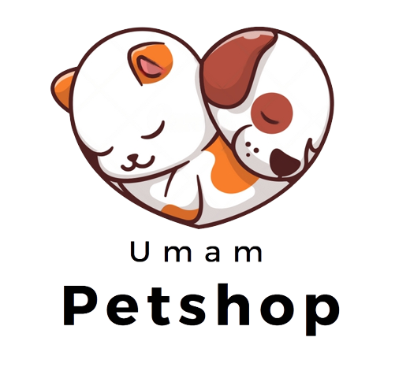

# **Petshop Program**



## **Context**

This project is an implementation of a Pet Store Item Management System in Python. This program allows pet store owners to manage inventory of pet-related items such as food, toys, and accessories. Apart from that, this program was also built to make it easier for buyers to make purchases using this application. This program was built with the aim of simplifying the task of tracking pet shop inventory and facilitating the purchasing process with features for sorting, searching and calculating price discounts for items that are accompanied by a certain discount value.

## **Business Tasks**

### **Key Features**

- Add new pet items to the inventory.
- Update existing item information (name, category, price, stock, etc.).
- Remove items from the inventory.
- Display a list of available items.
- Search for items by name, category, or price range.

### **Objectives**

- Streamline the management of pet shop inventory.
- Provide a user-friendly interface for adding, updating, and removing items.
- Enable quick and easy item searches to assist customers.

## **Stakeholders**

1. **Pet Shop Owners:** Owners of pet shops who want to efficiently manage their inventory.
2. **Store Staff:** Employees responsible for handling inventory tasks.
3. **Developers:** The development team responsible for building, maintaining, and updating the program.
4. **Pet Shop Customers:** Individuals looking to purchase pet-related items.

## **Limitations**

This project has several limitations to consider:

1. **Weak Authentication:** There is a weak authentication system, because there are only a few usernames and when the user inputs the username there is no password and the username is made visible.
2. **Single User:** The program is designed for use by a single user at a time.
3. **Limited Item Information:** The program stores basic item information but does not handle complex attributes.
4. **No Sales Tracking:** There is no functionality for tracking sales or generating reports.
5. **Simple sales process:** The process of selling and purchasing items by buyers can only be done per 1 item and must make payment first to purchase other items.

## **Data Summary**

The data used in this project includes:

- ID Item
- Item Name
- Category (Animal Name)
- Item Brand
- Price
- Discount Value
- Stock Quantity

This data will be used to create a local business database that users can search. Ensure this data is prepared before running the program.

## **User Instructions**

### **Running the Program**

To run the program, use the following command:
```python
python program-petshop.py
```

Follow the on-screen instructions to perform various inventory management tasks, including adding, updating, and removing items.

## Contribution

Contributions to this project are highly appreciated. If you wish to contribute, please create a pull request, and we will review it.

---

We hope this README helps you build a professional portfolio for your Yellow Pages project. Be sure to include user instructions, a license, and contribution guidelines as needed for your project.
